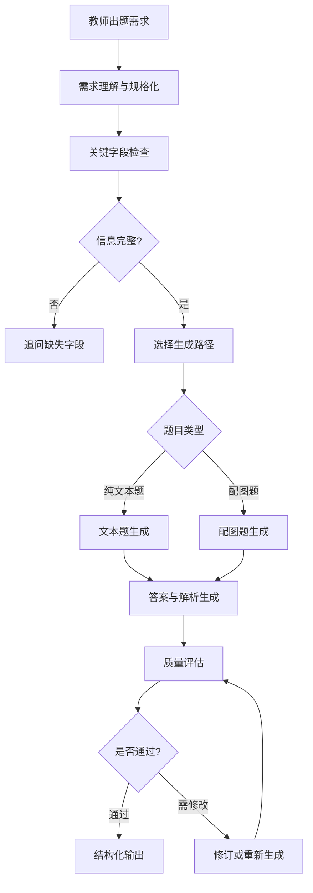

# 题目生成 Agent 项目介绍、核心逻辑与注意事项

> 题目生成 Agent 是一个面向教师出题和教育平台题库建设的智能体系统，它能够理解教师的出题需求，确认关键参数，生成符合学科、知识点、题型、难度和配图要求的结构化题目，并对生成结果进行基础质量评估。

## 1. 项目整体定位

### 1.1 这个 Agent 是什么

题目生成 Agent 的核心任务，是把教师或平台给出的出题需求，转化为可以直接展示、审核、保存和入库的题目结果。

它不是简单地让大模型“随便出一道题”，而是把出题过程拆成多个可控步骤：

```text
理解需求
  -> 提取出题参数
  -> 检查信息是否完整
  -> 确认教师控制字段
  -> 选择生成路径
  -> 生成题目
  -> 生成答案和解析
  -> 处理配图要求
  -> 执行质量评估
  -> 输出结构化结果
```

### 1.2 为什么需要 Agent

如果只使用普通大模型直接生成题目，容易出现几个问题：

1. **需求理解不稳定**
   教师说“出一道中等难度的勾股定理题”，模型可能没有明确学段、题型、是否配图、是否适合课堂小测。

2. **关键参数容易漂移**
   教师要求数学题，模型可能扩展到其他知识点；教师要求单选，模型可能生成简答；教师要求中等难度，模型可能生成过难或过简单。

3. **输出格式不稳定**
   有时模型返回一段自然语言，有时返回题干和答案，有时缺少解析，不方便前端展示和题库入库。

4. **配图题质量难控**
   图可能只是装饰，不参与解题；也可能图中数据和题干不一致。

5. **缺少质量评估**
   生成后如果没有检查，很难判断题目是否符合知识点、题型和答案要求。

题目生成 Agent 的价值，就是把这些不稳定的生成行为，组织成可控、可解释、可评估、可迁移的工作流。

### 1.3 项目目标

题目生成 Agent 的目标可以概括为四点。

第一，**让出题需求结构化**。

教师可以用自然语言表达需求，也可以通过页面表单选择参数。Agent 需要把这些输入整理成统一的出题规格。

第二，**让生成过程可控**。

学科、知识点、题型、难度、配图要求等关键字段必须来自教师或业务请求，Agent 不能擅自修改。

第三，**让生成结果可用**。

最终题目不能只是一段文字，而应该包含题干、选项、答案、解析、配图、元数据和质量评估，方便前端展示和后端入库。

第四，**让迁移部署可落地**。

Agent 的能力需要能被平台调用，能本地测试，能接入真实模型，也能在迁移阶段先用稳定样例跑通流程。

## 2. 主要功能

### 2.1 教师需求理解

Agent 首先要理解教师的出题需求。

教师可能会这样说：

```text
帮我生成一道初中数学勾股定理的单选题，难度中等，需要配图，解析要分步骤。
```

Agent 需要从中识别：

| 信息 | 识别结果 |
| --- | --- |
| 学段 | 初中 |
| 学科 | 数学 |
| 知识点 | 勾股定理 |
| 题型 | 单选题 |
| 难度 | 中等 |
| 配图要求 | 需要配图 |
| 解析要求 | 分步骤 |

如果输入来自前端表单，也可以直接接收结构化字段：

```json
{
  "grade_band": "初中",
  "subject": "数学",
  "knowledge_points": ["勾股定理"],
  "question_type": "single_choice",
  "difficulty": 3,
  "content_mode": "diagram_required"
}
```

### 2.2 关键字段确认

Agent 需要重点确认以下字段：

| 字段 | 为什么重要 |
| --- | --- |
| 学科 | 决定知识体系和表达方式 |
| 知识点 | 决定题目考查目标 |
| 题型 | 决定输出结构，例如单选、判断、填空 |
| 难度 | 决定推理深度和干扰项设计 |
| 是否配图 | 决定是否需要视觉信息 |
| 生成策略 | 决定是快速生成还是更重视推理和评估 |

如果缺少关键字段，Agent 应该追问，而不是自己猜。

例如用户只说：

```text
帮我出一道题。
```

Agent 应该追问：

```text
请补充学科、知识点、题型和难度。
```

这个机制保证了教师控制权，也减少了错误生成。

### 2.3 多题型生成

Agent 支持多种常见教育题型。

| 题型 | 说明 |
| --- | --- |
| 单选题 | 四个选项，只有一个正确答案 |
| 判断题 | 判断陈述正确或错误 |
| 填空题 | 有明确可判定答案 |
| 简答题 | 有参考答案和解析 |

不同题型有不同的质量要求。

例如单选题必须满足：

- 有 A、B、C、D 四个选项。
- 四个选项不能重复。
- 只有一个正确答案。
- 干扰项需要合理，不能明显无效。
- 解析需要说明为什么答案正确。

判断题必须满足：

- 题干陈述必须清楚。
- 答案必须是明确的 true 或 false。
- 解析需要解释判断依据。

填空题和简答题必须满足：

- 答案可判定。
- 解析能说明关键步骤。
- 不应出现多个互相冲突的答案。

### 2.4 配图题生成

配图题是这个 Agent 的重点能力之一。

配图题一般适合：

- 数学几何题。
- 物理受力分析题。
- 函数图像题。
- 电路图题。
- 条件关系图题。

以勾股定理题为例，一个有效图应该包含：

- 直角三角形。
- 直角标记。
- 已知两条直角边。
- 待求斜边。
- 与题干一致的点名和数值。

无效配图包括：

- 只有一个装饰性三角形，没有数值。
- 图中数值和题干不一致。
- 图和题目无关。
- 图不参与解题。

因此，Agent 对配图题的要求是：

```text
图必须与题干一致，并且必须帮助学生作答或理解解析。
```

### 2.5 答案和解析生成

题目生成不仅要生成题干，还要生成答案和解析。

答案用于判分和入库。

解析用于教学和学生理解。

解析应该满足：

- 面向学生可读。
- 关键公式或依据要写清楚。
- 推理步骤不要跳太大。
- 不暴露模型隐藏推理过程。
- 对常见错误可以适当解释。

例如勾股定理题的解析应该说明：

```text
因为 ∠C = 90°，AC 和 BC 是两条直角边。
根据勾股定理，AB² = AC² + BC²。
代入 AC = 6，BC = 8，得到 AB² = 36 + 64 = 100。
所以 AB = 10。
```

### 2.6 质量评估

生成完成后，Agent 需要做基础质量评估。

评估维度包括：

| 维度 | 说明 |
| --- | --- |
| 知识点一致性 | 是否考查指定知识点 |
| 难度匹配 | 是否符合目标难度 |
| 题型合规 | 是否符合单选、多选、判断等结构要求 |
| 答案正确性 | 答案是否存在并与解析一致 |
| 解析完整性 | 解析是否能支持学生理解 |
| 语言清晰度 | 题干是否清楚，表达是否适合学段 |
| 图文一致性 | 配图是否和题干一致，是否参与解题 |

评估结果可以帮助平台判断：

- 题目是否可以直接展示。
- 是否需要重新生成。
- 是否需要教师审核。
- 是否适合进入题库。

### 2.7 结构化输出

Agent 最终输出应该是结构化结果，而不是一段散文。

典型结果包含：

```text
题目规格 spec
题目列表 items
题干 stem
选项 options
答案 answer
解析 analysis
配图 diagrams
元数据 metadata
质量评估 evaluation
整体评估 evaluation_summary
生成过程 events
```

结构化输出的好处：

1. 前端可以直接渲染题目。
2. 后端可以直接保存到题库。
3. 评估模块可以读取字段检查质量。
4. 后续可以做重新生成、局部修改和人工审核。
5. OAH 或 EduNex 平台可以稳定调用。

## 3. Agent 工作流

### 3.1 总体流程

题目生成 Agent 的总体流程如下：



### 3.2 主 Agent

主 Agent 可以理解为题目生成流程的调度者。

名称：

```text
question-orchestrator
```

职责：

- 接收教师需求。
- 判断信息是否完整。
- 确认教师控制字段。
- 决定走文本题还是配图题流程。
- 协调生成和评估。
- 决定是否需要追问、修订或返回结果。

主 Agent 的价值在于，它不是简单生成题目，而是管理整个出题任务。

### 3.3 子 Agent 角色

题目生成可以拆成多个子角色。

| 子 Agent | 职责 |
| --- | --- |
| `spec-normalizer` | 把教师输入整理成标准出题规格 |
| `intent-recognizer` | 判断当前请求是否已经可以开始生成 |
| `text-question-generator` | 生成纯文本题 |
| `visual-question-generator` | 生成带图题 |
| `text-question-evaluator` | 评估文本题质量 |
| `visual-question-evaluator` | 评估配图题和图文一致性 |
| `student-simulator` | 模拟学生可能的错误和作答方式 |
| `profile-evolution` | 根据教师或学生画像优化后续生成 |

这些角色不一定都要以独立进程存在。更重要的是，它们表达了题目生成 Agent 的职责拆分。

### 3.4 教师控制字段和 Agent 控制字段

为了保证出题任务不偏离需求，需要区分两类字段。

教师控制字段：

```text
subject
knowledge_points
difficulty
question_type
content_mode
strategy
diagram
```

这些字段必须来自教师或业务请求，Agent 不能静默修改。

Agent 控制字段：

```text
generation_plan
draft_wording
solution_steps
evaluation_notes
suggested_profile_updates
```

这些字段可以由 Agent 生成和优化。

这样设计的原因是：

- 教师决定“要出什么题”。
- Agent 决定“怎么把题生成好”。

## 4. 示例场景

### 4.1 教师需求

```text
生成一道初中数学勾股定理单选题，难度中等，需要配图，用于课堂小测，解析要分步骤。
```

### 4.2 Agent 理解后的任务规格

```json
{
  "grade_band": "初中",
  "subject": "数学",
  "knowledge_points": ["勾股定理"],
  "question_type": "single_choice",
  "difficulty": 3,
  "count": 1,
  "content_mode": "diagram_required",
  "diagram": {
    "required": true,
    "position": "stem",
    "must_be_answer_relevant": true
  },
  "extra_requirements": "用于课堂小测，解析要分步骤。"
}
```

### 4.3 Agent 生成结果

```text
如图，在直角三角形 ABC 中，∠C = 90°，AC = 6，BC = 8，求斜边 AB 的长度。

A. 8
B. 10
C. 12
D. 14

答案：B

解析：
因为 ∠C = 90°，AC 和 BC 是两条直角边。
根据勾股定理，AB² = AC² + BC²。
代入 AC = 6，BC = 8，得到 AB² = 36 + 64 = 100。
所以 AB = 10。
```

## 5. 当前实现中的核心逻辑

这一部分用于给开发同学解释当前代码如何支撑 Agent 流程。PPT 前半部分建议讲功能和 Agent 流程，代码逻辑放后半部分。

### 5.1 关键文件

| 文件 | 作用 |
| --- | --- |
| `source/runtimes/tutor-question-generation/AGENTS.md` | 描述 Agent 架构、主 Agent、子 Agent、字段控制和路由规则 |
| `eduqg-question-generator/scripts/eduqg-core.mjs` | 当前题目生成流程的核心实现 |
| `eduqg-question-generator/scripts/entrypoint.mjs` | 当前运行入口，支持 CLI 和 HTTP 调用 |
| `eduqg-question-generator/examples/request.json` | 示例出题请求 |
| `eduqg-question-generator/schemas/edu-question-spec.schema.json` | 输入规格定义 |
| `eduqg-question-generator/schemas/eduqg-generation-result.schema.json` | 输出结果定义 |

### 5.2 核心调用链

当前实现中，题目生成主流程是：

```text
generateEduqgResult(payload, options)
  -> normalizeSpec(payload)
  -> findMissingFields(spec)
  -> clarificationResult(spec, missingFields)
  -> generateMockItems(spec) 或 callLiveModel(spec)
  -> finalizeResult(spec, rawItems)
  -> evaluateItem(item, spec)
```

对应到 Agent 逻辑：

| 代码函数 | Agent 角色含义 |
| --- | --- |
| `normalizeSpec` | 需求理解和规格化 |
| `findMissingFields` | 关键字段检查 |
| `clarificationResult` | 追问缺失信息 |
| `generateMockItems` | 本地稳定生成，用于演示和联调 |
| `callLiveModel` | 调用真实模型生成题目 |
| `finalizeResult` | 结构化输出 |
| `evaluateItem` | 基础质量评估 |

### 5.3 需求规格化

`normalizeSpec` 会把输入统一整理为标准出题规格。

它处理：

- 学科。
- 学段。
- 知识点。
- 题型。
- 难度。
- 数量。
- 是否配图。
- 教师偏好。
- 学生画像。

它还会处理一些中文别名。

例如：

| 输入 | 标准值 |
| --- | --- |
| 单选题 / 选择题 | `single_choice` |
| 多选题 | `multiple_choice` |
| 判断题 | `true_false` |
| 填空题 | `fill_blank` |
| 简答题 | `short_answer` |
| 简单 | `2` |
| 中等 | `3` |
| 困难 | `5` |

### 5.4 缺字段追问

`findMissingFields` 检查四个核心字段：

```text
subject
knowledge_points
question_type
difficulty
```

如果字段缺失，系统不进入生成，而是返回追问结果。

这个逻辑对应 Agent 中的“确认出题意图”。

### 5.5 题目生成

当前实现支持两种生成方式。

第一种是本地样例生成。

作用：

- 本地演示。
- 前后端联调。
- 验证 Agent 流程。
- 在没有模型密钥时跑通链路。

第二种是真实模型生成。

作用：

- 根据完整规格调用模型。
- 生成真实题干、选项、答案和解析。
- 输出 JSON 结果。

真实模型调用需要配置：

```text
EDUQG_API_KEY
EDUQG_API_URL
EDUQG_MODEL
```

### 5.6 结果标准化

`finalizeResult` 会把生成结果整理成统一格式。

每道题包含：

```text
question_id
type
stem
options
answer
analysis
diagrams
metadata
evaluation
```

这样前端、后端和评估逻辑都能稳定读取。

### 5.7 基础质量评估

`evaluateItem` 会检查：

- 题干是否为空。
- 答案是否为空。
- 解析是否为空。
- 题型是否被改变。
- 单选题是否有 A/B/C/D 四个选项。
- 单选题答案是否为 A/B/C/D。
- 选项是否重复。
- 多选题答案是否为数组。
- 必须配图时是否有图。

它会输出：

```text
score
status
issues
dimensions
```

这对应 Agent 中的 evaluator 角色。

## 6. 当前状态

当前版本已经可以本地运行和测试。

已验证内容：

| 能力 | 状态 |
| --- | --- |
| CLI 入口 | 可运行 |
| 示例请求生成 | 可运行 |
| HTTP 接口 | 可运行 |
| 结构化输出 | 可返回 |
| 缺字段追问 | 可返回 |
| 配图样例 | 可返回 SVG |
| 基础质量评估 | 可返回评分和状态 |
| Agent runtime 合约 | 已按原 OAH Agent 合约补齐 |
| 原 Agent 工具链 | 9 个工具名均已暴露并通过本地 HTTP 冒烟测试 |
| Agent 提示模板 | 主 Agent + 8 个子 Agent 共 9 套模板已落地，并纳入 OAH 合约检查 |

当前迁移结论：

```text
当前实现已经按本地可见的原 Agent 合约完成迁移覆盖：
主 Agent、子 Agent 职责、教师控制字段、出题规范、生成路线、评估路线、配图路线、EvoQ 路线、学生模拟和画像读写工具均已在 skill-version 中落地。
主 Agent 和 8 个子 Agent 的提示模板也已在运行代码中落地，可通过 CLI 或 HTTP 导出检查。
```
