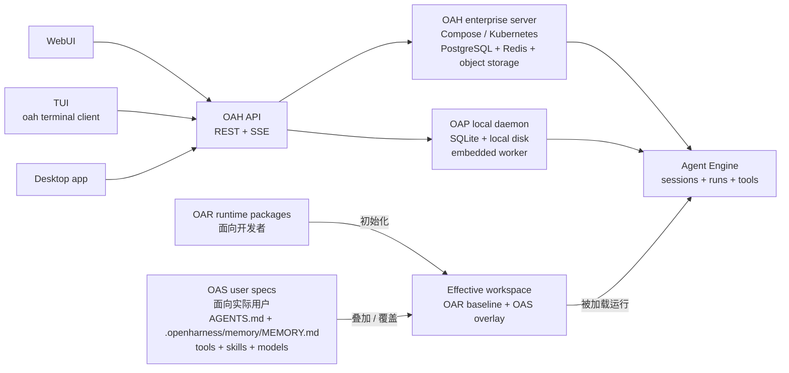

<p align="center">
  <picture>
    <source media="(prefers-color-scheme: dark)" srcset="assets/logo-readme-dark.png" />
    
  </picture>
</p>

<h1 align="center">Open Agent Harness</h1>

<p align="center">
  面向企业内部 AI 平台、Agent 产品和嵌入式 Copilot 场景的 headless、workspace-first Agent Engine。
</p>

<p align="center">
  <a href="./README.md">English</a> · <a href="./docs/getting-started.md">快速开始</a> · <a href="./docs/README.md">文档</a>
</p>

---

## 它是什么

Open Agent Harness（OAH）是一个面向 Agent 系统的后端运行时引擎。

你可以保留自己的产品表层能力，比如聊天 UI、认证、租户模型、业务流程和产品体验；OAH 负责底下这一层执行引擎：

- workspace 加载与能力发现
- session 与 run 编排
- 模型与工具循环执行
- sandbox 与文件/命令访问接口
- 队列、流式事件、恢复与审计
- 本地和拆分部署拓扑

它不是开箱即用的 SaaS 应用，也不是一个面向终端用户打磨完成的聊天产品。
它更像是你可以拿来构建这些产品的可编程运行时内核。

## 当前状态

这个仓库现在已经不只是架构草图，当前已经包含：

- 一套可运行的 HTTP API，覆盖 workspaces、sessions、runs、actions、sandboxes、models、storage inspection 和 SSE streaming
- 明确的多进程拓扑，包括 `oah-api`、`oah-controller` 和承载 standalone worker 的 sandbox
- 一个用于会话、运行状态、存储和系统观测的 WebUI
- 一个用于 workspace 选择、session 对话、流式输出和终端工作流的 TUI
- 针对 agents、models、skills、tools、actions、hooks、prompts 和项目说明的 workspace 自动发现机制
- 自带 deploy-root 模板、starter runtimes 和对象存储同步流程
- 本地 Docker Compose 启动方式，以及 Kubernetes / Helm 的 split deployment 骨架

如果你正在评估 OAH 能否作为 Agent Engine 基座，当前仓库已经足够拿来跑通、观察和扩展。

## 可以用它构建什么

当你需要一套可复用的 Agent 后端去承载多个项目或团队时，OAH 会比较合适：

- 带 repo 定制 agent 和 tools 的工程 Copilot
- 多 Agent 产品，共享同一套 runtime substrate
- 嵌入到现有产品里的 Copilot 或 Agent 能力
- 面向单个仓库或单个租户的专属后端
- 希望掌控运行时而不是只包一层聊天界面的平台型团队

## 架构与部署形态

OAH 可以按一套基础设施层级来理解：

| 层级 | 面向对象 | 名称 | 定位 |
| --- | --- | --- | --- |
| `OAR` | 开发层 | Open Agent Runtime | 由平台 / runtime 开发者构建和发布的可复用 runtime bundle，用来初始化 workspace。 |
| `OAS` | 用户层 | Open Agent Spec | 用户基于 OAR / runtime 基线叠加的 tools、skills、model entries、`AGENTS.md`、`.openharness/memory/MEMORY.md` 以及其他 workspace 级增量配置。 |
| `OAH` | 服务层 | Open Agent Harness | 企业/平台服务部署形态，面向 Compose 或 Kubernetes、PostgreSQL、Redis、对象存储、controller、sandbox fleet 和多 worker。 |
| `OAP` | 服务层 | Open Agent Harness Personal | 个人服务部署形态，面向本地 daemon、SQLite、本地磁盘、embedded worker 和单用户工作流。 |

WebUI、TUI 和 Desktop 都连接同一套 OAH-compatible API；它们既可以连接企业服务，也可以连接本地个人守护进程。Desktop 不是 OAP 专属；只有连接 OAP local daemon 时，才额外启用本地 daemon supervisor 能力。



因此，OAH 和 OAP 的差异应该落在部署 profile、存储后端、worker / sandbox 形态和默认目录上，而不是客户端协议上。
它也明确了作者边界：开发者发布 OAR runtimes，实际用户把 OAS specs 叠加到 runtime-backed workspace 上。
客户端应先读取 server profile，例如 `GET /api/v1/system/profile`，再决定启用企业侧专属或个人本地专属行为。

## 核心模型

系统围绕四个核心概念展开：

| 概念 | 边界 | 含义 |
| --- | --- | --- |
| `sandbox` | 执行宿主边界 | 定义承载 workspace 的宿主环境，以及文件/命令执行实际落在哪里 |
| `workspace` | 能力边界 | 定义这个执行环境中的 agents、models、skills、tools、actions、hooks 和 prompts |
| `session` | 上下文边界 | 一个 workspace 内持续存在的对话或协作线程 |
| `run` | 执行边界 | 一次进入队列并执行的模型/工具循环 |

这让 OAH 的工作模型保持清晰：

- sandbox 定义系统“在哪里执行”
- workspace 定义系统在这个宿主边界内“能做什么”
- session 定义持续上下文
- run 在同一 session 内串行执行

## 已经可用的能力

### Runtime 与 API

- Workspace CRUD，以及 runtime/blueprint 导入和 catalog 查看
- Session 创建、消息分页读取、异步消息入队
- Run 查询、步骤级审计、取消、排队 run 的 `guide` 提升，以及手动 `requeue`
- 手动 session compaction，并持久化 `compact_boundary` 与 `compact_summary`
- 面向 run 和 session 更新的 SSE 流式事件
- 以 `/workspace` 为根的 sandbox 兼容文件与命令 API

### Workspace 能力系统

OAH 现在已经把 workspace 作为一组可组合的能力包来理解：

- `AGENTS.md` 项目说明
- `.openharness/agents/*.md`
- `.openharness/models/*.yaml`
- `.openharness/actions/*/ACTION.yaml`
- `.openharness/skills/*/SKILL.md`
- `.openharness/tools/settings.yaml` 以及本地/远程 MCP servers
- `.openharness/hooks/*.yaml`
- `.openharness/prompts.yaml` 和 `.openharness/settings.yaml`

这意味着真正的定制边界是 workspace，而不是全局进程配置。

### 客户端与运维

- 支持流式对话视图的 WebUI
- UI 中可见的服务端 follow-up queue，以及显式 `Guide` 打断流程
- 用于查看 messages、run steps、system prompt、provider calls、catalog snapshot 和 records 的 inspector 面板
- 面向 PostgreSQL 和 Redis 的 storage workbench，支持 `messages.content` 检视以及手动队列/恢复操作
- health/readiness 接口，以及 controller 的 metrics/snapshot 面板
- 面向终端的 TUI，可用于 workspace/session 检视和流式对话

## WebUI

仓库自带一个用于会话、运行状态、存储和系统观测的 WebUI：

<p align="center">
  
</p>

它的设计重点是运行时可观测性，而不只是聊天：

- 对话流式输出与 run 跟踪
- 输入框上方展示排队中的后续消息
- run step 和 tool call 检视
- 原始 message / run / session 记录查看
- PostgreSQL 与 Redis 的存储检视

## TUI

如果你更常在终端里工作，OAH 也提供了基于 Ink 的 TUI：

<p align="center">
  
</p>

TUI 使用的仍然是同一套 API 与 SSE 接口。它适合在 repo 或 shell 内直接选择 workspace、创建或恢复 session、查看流式输出，并在不打开浏览器的情况下工作。

```bash
pnpm dev:cli -- --base-url http://127.0.0.1:8787 tui
```

## Desktop

Desktop 是后续桌面客户端形态，不是 OAP 专属产品。它应和 WebUI、TUI 一样连接同一套 OAH-compatible API，通过 server profile 展示当前连接的是 OAH 还是 OAP，并且只在服务端声明支持时启用本地 daemon supervisor 能力。

## 架构速览

| 层次 | 职责 |
| --- | --- |
| API server | OpenAPI 入口、参数校验、调用方上下文、SSE、路由 |
| Session/run orchestration | session 内串行调度、取消、超时、恢复 |
| Context engine | prompt 装配、agent/model 解析、能力暴露 |
| LLM loop + dispatch | 模型调用、工具调用、agent 切换、subagent delegation |
| Worker execution | active workspace copy、文件访问、命令执行、sandbox 生命周期 |
| Control plane | placement 信号、worker 生命周期、扩缩容与 ownership 治理 |
| Storage | PostgreSQL 真值、Redis 队列/锁/事件分发、本地运行时状态 |

当前明确的生产方向是拆分拓扑：

- `oah-api` 负责入口与编排
- `oah-controller` 负责控制面逻辑
- standalone workers 运行在 `oah-sandbox` 或兼容的 sandbox backend 中

## 仓库结构

```text
apps/
  server/       # API server、worker 入口、bootstrap、HTTP routes
  controller/   # 控制面进程
  worker/       # worker 包装层
  web/          # WebUI
  cli/          # TUI 与终端命令入口
packages/
  engine-core/      # 运行时编排与内建工具层
  api-contracts/    # zod schema 和共享 API 类型
  model-runtime/    # 模型提供方抽象
  storage-*         # postgres / redis / sqlite / memory 存储实现
  config/           # workspace 与 server 配置加载
template/
  deploy-root/      # starter OAH_DEPLOY_ROOT，包含 runtimes/models/tools/skills 结构
docs/
  ...               # 架构、workspace、engine、部署、OpenAPI 文档
```

## 快速开始

先选择部署形态：

- **OAP personal daemon**：本地单用户使用，SQLite、本地磁盘、embedded worker。
- **OAH enterprise/split stack**：团队或平台使用，PostgreSQL、Redis、对象存储、controller、sandbox workers、Compose 或 Kubernetes。

### 前置要求

- Node.js `24+`
- `pnpm` `10+`
- Docker + Docker Compose，用于 OAH split stack
- Helm 和 `kubectl`，用于 Kubernetes 部署

### 个人本地守护进程（OAP）

最终产品形态建议是：

```bash
oah daemon start
oah tui --workspace /path/to/repo
```

在这个命令正式接入 CLI 之前，当前开发期等价命令是：

```bash
pnpm install

export OAH_HOME="${OAH_HOME:-$HOME/.openagentharness}"
test -f "$OAH_HOME/config/daemon.yaml" || mkdir -p "$OAH_HOME"
test -f "$OAH_HOME/config/daemon.yaml" || cp -R ./template/deploy-root/. "$OAH_HOME"/

pnpm exec tsx --tsconfig ./apps/server/tsconfig.json ./apps/server/src/index.ts -- \
  --config "$OAH_HOME/config/daemon.yaml"
```

然后让客户端连接这个本地 daemon：

```bash
pnpm dev:cli -- --base-url http://127.0.0.1:8787 tui
pnpm dev:web
```

### 企业本地整套服务（OAH）

如果你希望在本地跑 split service topology，包括 PostgreSQL、Redis、MinIO、controller 和 sandbox workers，使用下面这条路径。

#### 1. 安装依赖

```bash
pnpm install
```

#### 2. 准备 deploy root

```bash
mkdir -p /absolute/path/to/oah-deploy-root
cp -R ./template/deploy-root/. /absolute/path/to/oah-deploy-root
export OAH_DEPLOY_ROOT=/absolute/path/to/oah-deploy-root
```

本地开发可以省略 `OAH_DEPLOY_ROOT`；`pnpm local:up` 和 `pnpm storage:sync` 默认使用 `OAH_HOME`（或 `~/.openagentharness`）。只有想把部署资产根目录和个人 home 分开时再显式设置 `OAH_DEPLOY_ROOT`。

然后至少在下面目录中放入一个平台模型 YAML：

```text
$OAH_DEPLOY_ROOT/models/
```

对于仓库自带的 starter runtimes，默认期望的平台模型名是：

```text
openai-default
```

#### 3. 启动本地整套服务

```bash
pnpm local:up
```

这会启动：

- PostgreSQL
- Redis
- MinIO
- `oah-api`
- `oah-controller`
- `oah-compose-scaler`
- `oah-sandbox`

启动过程中还会自动执行一次 storage sync。本地 split 拓扑下，`oah-api` 不再持久化 active workspace copy；可写 workspace 状态由 `oah-sandbox` 承载，并通过对象存储 backing store flush 回 OSS/MinIO。

#### 4. 启动 WebUI

```bash
pnpm dev:web
```

也可以启动终端 TUI：

```bash
pnpm dev:cli -- --base-url http://127.0.0.1:8787 tui
```

本地默认地址和客户端命令：

| 服务 | 地址 / 命令 |
| --- | --- |
| WebUI | `http://localhost:5173` |
| TUI | `pnpm dev:cli -- --base-url http://127.0.0.1:8787 tui` |
| API | `http://127.0.0.1:8787` |
| Sandbox worker host | `http://127.0.0.1:8788` |
| Controller metrics | `http://127.0.0.1:8789` |
| MinIO Console | `http://127.0.0.1:9001` |

## 其他运行方式

### Kubernetes / Helm

集群部署时，可以把 deploy-root 中的 Kubernetes profile 作为 Helm `server.yaml` 来源：

```bash
export OAH_DEPLOY_ROOT=/absolute/path/to/oah-deploy-root

helm upgrade --install oah ./deploy/charts/open-agent-harness \
  --namespace open-agent-harness \
  --create-namespace \
  --set-file config.serverYaml="$OAH_DEPLOY_ROOT/config/kubernetes.server.yaml"
```

生产 values、凭证、持久化和安全加固细节见 [部署说明](./docs/deploy.md)。

### 单 Workspace 模式

如果你只想直接服务一个 repo，而不走多 workspace 管理路径，可以这样启动：

```bash
pnpm exec tsx --tsconfig ./apps/server/tsconfig.json ./apps/server/src/index.ts -- \
  --workspace /absolute/path/to/workspace \
  --model-dir /absolute/path/to/models \
  --default-model openai-default
```

### 拆分进程部署

如果是生产或类生产环境，推荐拆成：

- `oah-api` 作为 API 入口
- `oah-controller` 作为控制面
- 在 `oah-sandbox` 内承载 standalone workers

仓库当前已经自带：

- `docker-compose.local.yml`
- `deploy/kubernetes/` 下的 Kubernetes manifests
- `deploy/charts/open-agent-harness/` 下的 Helm chart
- 生产用 `Dockerfile`
- GitHub Actions 镜像发布工作流

## Starter Runtime 模板

deploy-root 模板目前内置两个 starter runtimes：

- `micro-learning`
  - 用于短教学闭环，包含 `learn`、`plan`、`eval`、`research` agents
- `vibe-coding`
  - 面向编码流程，包含 `build`、`plan`、`general`、`explore` agents

它们是新 workspace 的初始化模板，不是运行时的 active workspace copy 本体。

## 常用命令

```bash
pnpm build
pnpm test
pnpm exec tsx --tsconfig ./apps/server/tsconfig.json ./apps/server/src/index.ts -- --config "$HOME/.openagentharness/config/daemon.yaml"
pnpm dev:web
pnpm dev:cli -- --base-url http://127.0.0.1:8787 tui
pnpm storage:sync
pnpm storage:sync -- --include-workspaces
pnpm local:up
pnpm local:down
helm upgrade --install oah ./deploy/charts/open-agent-harness --namespace open-agent-harness --create-namespace --set-file config.serverYaml=/absolute/path/to/oah-deploy-root/config/kubernetes.server.yaml
```

## 文档导航

| 文档 | 说明 |
| --- | --- |
| [快速开始](./docs/getting-started.md) | 本地启动与初次验证 |
| [架构总览](./docs/architecture-overview.md) | 系统边界与主要层次 |
| [Workspace 指南](./docs/workspace/README.md) | Workspace 结构与能力发现 |
| [Engine 概览](./docs/engine/README.md) | 运行时生命周期、context engine 与执行流程 |
| [API 参考](./docs/openapi/README.md) | REST + SSE 接口说明 |
| [部署说明](./docs/deploy.md) | 本地、拆分部署与 Kubernetes 路径 |
| [Home 与 Deploy Root](./docs/home-and-deploy-root.md) | `OAH_HOME`、`OAH_DEPLOY_ROOT`、local daemon 与部署 profile |
| [Deploy Root Template](./template/deploy-root/README.md) | `OAH_DEPLOY_ROOT` 模板结构 |

## 未来愿景

长期来看，我们希望 OAH 成为一套面向严肃 Agent 系统的开放运行时内核，而不是停留在 demo 栈。

当前已经比较明确的方向包括：

- 成为可以承载多种产品表层的稳定 agent-engine backend
- 持续增强控制面在 placement、warm capacity、恢复和 drain 上的能力
- 抽象出更清晰的 sandbox host 边界，让自托管 sandbox 和 E2B-like backend 共享同一套契约
- 让 runtimes、skills、tools 和 models 的 workspace 打包与分发能力更成熟
- 让 compaction、恢复、action execution 和 audit trails 这些运行时语义更一等公民

之所以强调这些，是因为 Agent 产品真正困难的部分，通常并不是聊天框本身，而是底层的运行时纪律：执行边界、可重复性、可追踪性、workspace 隔离，以及可运维性。OAH 正在朝这个方向打磨。

## 适合谁使用

**适合**

- 构建企业内部 AI 平台或嵌入式 Copilot 的团队
- 希望保留自己前端和认证体系的产品团队
- 需要 workspace 隔离和可观测执行过程的工程团队
- 希望从单机 local agent 演进到 split deployment 的平台团队

**不太适合**

- 你只想要一个开箱即用的聊天 UI
- 你只需要一个很小的本地脚本
- 你并不需要 workspace 边界、队列或运行时生命周期管理
