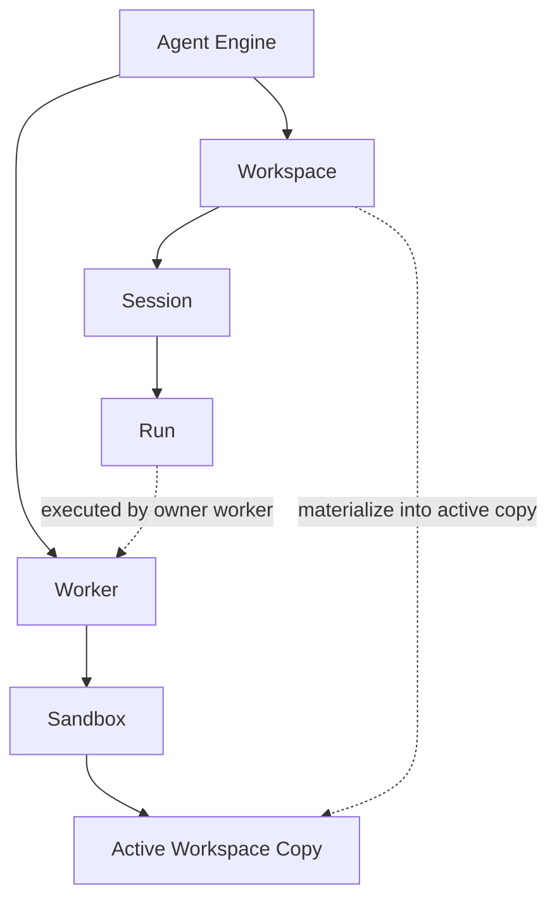

# Concept Relationships

This page answers one question:

How do these concepts fit together on one map?

If you remember only one sentence, use this:

`workspace` is the logical project boundary, `sandbox` is the execution host boundary, and `worker` is the execution role running inside that host.

## Two Main Chains

You need to read the system through two chains at the same time.

### Logical Chain

`Agent Engine -> Workspace -> Session -> Run`

This chain answers:

- which project is active
- which capabilities that project declares
- which workspace a session belongs to
- how one execution becomes a run

### Execution Chain

`Agent Engine -> Worker -> Sandbox -> Active Workspace Copy`

This chain answers:

- who executes
- where execution happens
- which active execution copy receives file and command operations

## One Diagram

## What Each Concept Actually Means

| Concept | What it is | What it is not |
| --- | --- | --- |
| `Agent Engine` | The scheduling, execution, recovery, audit, and API / SSE system | Not a single agent definition |
| `Workspace` | The project, capability-discovery, and session-ownership boundary | Not an execution host |
| `Session` | A continuous collaboration context inside one workspace | Not an execution thread |
| `Run` | One model inference and tool loop | Not a long-lived container |
| `Worker` | The role that executes runs | Not the project itself |
| `Sandbox` | The filesystem and process host where a worker runs | Not another name for workspace |
| `Active Workspace Copy` | The active execution copy of a workspace inside a host, meaning the actual files used for reads, writes, and commands inside the sandbox | Not a separate workspace kind |
| `Runtime` | The initialization source used when creating a workspace | Not the active execution copy |
| `Spec` | The user-authored extension layer added to a runtime | Not the whole runtime structure |

## The Three Most Common Confusions

### Workspace vs Sandbox

| Comparison | Workspace | Sandbox |
| --- | --- | --- |
| Focus | Project and capabilities | Host and execution environment |
| Main question | "Which project is this?" | "Where is it running?" |
| Typical contents | `AGENTS.md`, agents, models, skills, hooks | Filesystem, processes, commands, mount points |
| API noun | `/workspaces` | `/sandboxes` |

Conclusion:

- workspace defines project identity and capability set
- sandbox defines filesystem and process context for the active copy

### Workspace vs Runtime

| Comparison | Workspace | Runtime |
| --- | --- | --- |
| Focus | Current project | Initialization source |
| Used when | Running, discovering capabilities, executing tasks | Creating a workspace |
| Participates in current execution | Yes | No |

Conclusion:

- runtime answers "what do we initialize from?"
- workspace answers "what project are we actually running now?"

### Worker vs Sandbox

| Comparison | Worker | Sandbox |
| --- | --- | --- |
| Focus | Execution role | Execution host |
| Main question | "Who executes?" | "Which environment hosts execution?" |
| Typical actions | Consume runs, drive the tool loop, flush / evict | Provide files, processes, commands, mounts, lifecycle |

Conclusion:

- worker is the role
- sandbox is the environment that hosts that role

## Why File APIs Are Sandbox-Scoped

File reads, writes, and command execution always target the active execution copy, not abstract workspace metadata.

So:

- use `/workspaces` for catalog, metadata, create, delete, and lifecycle
- use `/sandboxes` for file reads, file writes, and command execution

This keeps the API shape stable across:

- `embedded`
- `self_hosted`
- `e2b`

## How an Active Workspace Moves

Typical flow:

1. a workspace is created or imported logically
2. controller / owner routing decides which worker owns it
3. the worker materializes an `Active Workspace Copy` in its host environment
4. runs perform file operations, commands, and tool calls against that `Active Workspace Copy`
5. on idle, drain, or delete, the workspace is flushed / evicted back to external storage or the managed source root

## Embedded vs Remote

| Mode | Where the active execution copy usually lives |
| --- | --- |
| `embedded` | A locally accessible workspace on the same machine |
| `self_hosted` | An `Active Workspace Copy` inside a remote sandbox |
| `e2b` | An `Active Workspace Copy` inside a remote E2B sandbox |

Important:

- the logical workspace identity stays the same
- only the host location of the active execution copy changes

## How To Use This Map While Reading Docs

If you are reading:

- `terminology.md`
  read it for naming boundaries
- `workspace/README.md`
  read it for what a workspace declares
- `server-config.md`
  read it for where these objects land in deployment
- `openapi/workspaces.md`
  read it for project and capability management
- `openapi/files.md`
  read it for file and command access on the active execution copy

## Recommended Memory Aid

Remember this order:

1. `Runtime` initializes a `Workspace`
2. `Spec` extends a `Runtime`
3. `Engine` runs a `Workspace`
4. `Worker` executes a `Run` inside a `Sandbox`
5. an active `Workspace` materializes into an `Active Workspace Copy`
