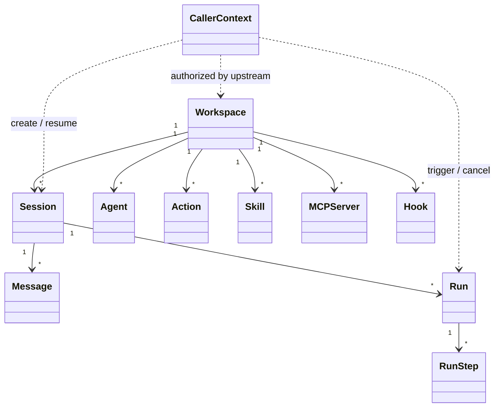

# Domain Model

领域对象分四类：访问上下文与工作区域、对话与执行、能力定义、运行时扩展。

## 1. 访问上下文与工作区域

### CallerContext

外部身份与访问上下文，由上游认证服务 / API Gateway 传入，运行时只消费不维护。

| 字段 | 说明 |
|------|------|
| `subject_ref` | 外部主体引用（opaque string），可以是用户、服务账号或自动化任务 |
| `scopes` | 授权范围 |
| `workspace_access` | 可访问的 workspace 列表 |
| `auth_source` | 认证来源标识 |
| `metadata` | 扩展字段 |

### Workspace

配置发现、执行环境和运行策略绑定的核心对象。

| 字段 | 说明 |
|------|------|
| `id` | 唯一标识 |
| `kind` | 当前固定为 `project` |
| `external_ref` | 映射外部系统中的项目 / 仓库 / 业务对象 |
| `name` | 显示名称 |
| `root_path` | workspace 根目录路径 |
| `execution_policy` | 执行策略，默认 `local` |
| `status` | 状态 |
| `metadata` | 扩展字段（jsonb） |
| `created_at` / `updated_at` | 时间戳 |

约束：

- `project` -- 完整能力，可按 agent allowlist 暴露工具与执行
- workspace 统一加载 prompt / agent / model / action / skill / tool / hook
- workspace 统一维护本地 `.openharness/data/history.db`

## 2. 对话与执行域

### Session

某个调用主体在某个 workspace 下的一条会话。

| 字段 | 说明 |
|------|------|
| `id` | 唯一标识 |
| `workspace_id` | 所属 workspace |
| `subject_ref` | 外部主体引用（仅用于审计和访问追踪） |
| `agent_name` | 创建时绑定的 agent |
| `active_agent_name` | 当前 session 默认使用的 primary agent，可切换 |
| `title` | 会话标题 |
| `status` | 状态 |
| `last_run_at` | 最近一次 run 时间 |
| `auth_context` | 认证上下文快照（jsonb） |
| `created_at` / `updated_at` | 时间戳 |

约束：同一 session 同时最多一个 active run。

### Message

对话消息。

| 字段 | 说明 |
|------|------|
| `id` | 唯一标识 |
| `session_id` | 所属 session |
| `run_id` | 产生该消息的 run（可为空） |
| `role` | `user` / `assistant` / `tool` / `system` |
| `content` | AI SDK 风格：纯文本或 message parts 数组（`text` / `tool-call` / `tool-result`） |
| `metadata` | 扩展字段（jsonb） |
| `created_at` | 时间戳 |

### Run

一次实际执行（模型推理 + 工具循环）。

| 字段 | 说明 |
|------|------|
| `id` | 唯一标识 |
| `workspace_id` / `session_id` | 所属 workspace 和 session（session_id 可为空，用于脱离会话的独立 action run） |
| `parent_run_id` | 父 run（subagent / background run 场景） |
| `trigger_type` | `message` / `manual_action` / `api_action` / `hook` / `system` |
| `trigger_ref` | 触发源引用 |
| `initiator_ref` | 来自外部 caller context |
| `agent_name` | run 启动时的初始 agent |
| `effective_agent_name` | 当前实际绑定的 agent（run 内可切换） |
| `switch_count` | agent 切换次数（用于策略限制） |
| `status` | 状态 |
| `started_at` / `ended_at` | 执行时间窗 |
| `error_code` / `error_message` | 错误信息 |
| `metadata` | 扩展字段（jsonb） |

约束：同一 session 的多个 run 由队列串行执行。

### RunStep

Run 内的步骤级记录，用于诊断、审计和可视化。

| 字段 | 说明 |
|------|------|
| `id` | 唯一标识 |
| `run_id` | 所属 run |
| `seq` | 步骤序号 |
| `step_type` | 步骤类型（`model_call` / `tool_call` / `agent_switch` / `agent_delegate` 等） |
| `name` | 步骤名称 |
| `agent_name` | 执行该步骤时的 agent |
| `status` | 状态 |
| `input` / `output` | 输入输出（jsonb） |
| `started_at` / `ended_at` | 执行时间窗 |

## 3. 能力定义域

### Agent

调用方可见的协作主体。Agent 是配置定义，不保存执行状态。

可配置项：

- 模型入口、system prompt、`system_reminder`
- action / skill / tool / native tool allowlist
- 允许切换到的 primary agent（`switch`）
- 允许调用的 subagent（`subagents`）
- 运行策略和限制（`policy`）

来源：平台内建 或 workspace `agents/*.md`（frontmatter 为元数据，正文为 prompt）。同名时 workspace agent 覆盖平台 agent。

### Native Tool

平台内建能力：`AskUserQuestion`、`Bash`、`TerminalOutput`、`TerminalInput`、`TerminalStop`、`LS`、`Read`、`Write`、`Edit`、`MultiEdit`、`Glob`、`Grep`、`ViewImage`、`WebFetch`、`TodoWrite`。

native tool 是否暴露由 workspace 声明与运行时能力共同决定。

### Action

命名任务入口，强调可复用、可独立触发、可审计。可由 agent 调用，也可由 API 直接调用。适合 `review` / `test` / `build` 等场景。

### Skill

能力封装，强调"完成某类工作的方法包"。以目录形式存在（入口 `SKILL.md`），可组合 shell / tool / action / 代码逻辑。适合 `repo.explorer` / `doc.reader` / `log.analyzer` 等场景。默认以 catalog 暴露，完整内容通过 `Skill` 工具按需加载。

### Tool Server

外部 tool 连接定义（当前基于 MCP 协议）。声明连接方式和可用工具，保留独立的连接、认证和健康检查治理。

### Model Entry

可选用的模型入口，分两层：

| 来源 | 说明 | canonical ref |
|------|------|---------------|
| Platform | 服务端统一注册，公共 provider / 平台托管密钥 | `platform/<model-name>` |
| Workspace | workspace 本地声明，私有 endpoint / 自带 key | `workspace/<model-name>` |

两层在 workspace 内统一可见。Agent 通常通过 `settings.yaml` 中的模型别名选择模型入口，加载后再解析为具体 `model_ref`。底层 `provider` 字段对齐 AI SDK provider 标识。

### Hook

运行时扩展机制，不对 LLM 暴露。

- 订阅生命周期事件，可选 `matcher` 过滤
- 拦截并改写上下文、模型请求或执行请求
- handler 类型：`command` / `http` / `prompt` / `agent`
- 输入输出协议参考 Claude Code 的 JSON stdin/stdout 模式
- 必须声明能力边界

## 4. 运行时扩展

### Registries

系统维护独立的注册表：`AgentRegistry`、`ModelRegistry`、`ActionRegistry`、`SkillRegistry`、`McpRegistry`、`HookRegistry`、`NativeToolRegistry`。

各 registry 生命周期、加载来源、权限策略独立。只在 LLM tool exposure 阶段统一投影。

### Invocation Projection

Run 启动时：

1. 解析 agent 引用的 model entry
2. 汇总本次允许访问的能力
3. 将 Action / Skill / Tool / Native Tool 投影为 tool descriptors
4. 模型返回的 tool name 反查来源类型，分发到对应执行器

统一仅发生在调用协议层，领域模型和注册表不合并。

## 5. 关系图

## 6. 当前不做

为控制范围，当前不引入：DAG workflow node、reusable pipeline template、action branch/loop/retry graph、multi-level AGENTS inheritance tree。这些可在后续兼容追加。
