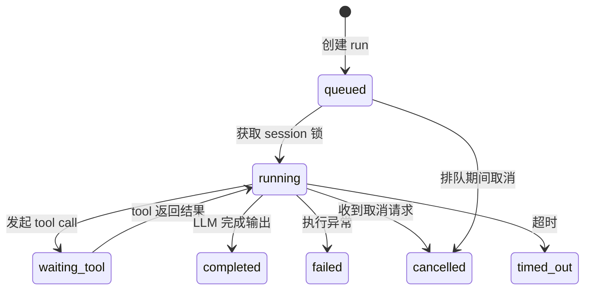

# Run Lifecycle

一个 run 从用户发送消息开始，经过队列、上下文构建、LLM 循环、tool 执行，最终产出 assistant 响应。

## 状态流转



| 状态 | 含义 |
| --- | --- |
| `queued` | 已入 session 队列，等待锁 |
| `running` | 正在执行 LLM loop |
| `waiting_tool` | 等待 tool call 结果 |
| `completed` | 正常完成 |
| `failed` | 不可恢复错误 |
| `cancelled` | 被显式取消 |
| `timed_out` | 超过 `policy.run_timeout_seconds` |

## 执行阶段

### 1. 接收请求

`POST /sessions/{id}/messages` 发送消息，API 立即返回 `202 Accepted`。

### 2. 持久化 message

用户消息写入 PostgreSQL `messages` 表，确保不丢失。

### 3. 创建 run

在 `runs` 表创建记录，状态 `queued`。记录 `trigger_type`（message / manual_action / api_action / hook / system）。

### 4. 入 session 队列

Run 投递到 Redis session 队列。同 session 内 run 严格串行。

### 5. 获取 session 锁

Worker 取出 run，获取 Redis 分布式锁，状态变为 `running`，发布 `run.started`。

### 6. 准备模型输入

先基于 session 历史构建 Engine Messages，并在需要时执行自动 compact。

### 7. 构建上下文

Context Engine 装配完整上下文：workspace 配置、agent prompt、prompt 段拼装（base → llm_optimized → agent → actions → project_agents_md → skills）、session 历史、tool catalog。

顺序上：

1. `before_context_compact`（仅在触发自动 compact 时执行）
2. 生成 compact summary
3. `after_context_compact`（仅在触发自动 compact 时执行）
4. `before_context_build`
5. 静态 system prompt + history + reminder 装配
6. `after_context_build`
7. `before_model_call`

### 8. LLM loop

上下文发送给模型，流式增量推送输出。模型完整响应返回后执行 `after_model_call` hook。

### 9. 分发 tool call

LLM 输出 tool call 时：状态进入 `waiting_tool` → 执行 `before_tool_dispatch` hook → Dispatcher 路由到对应 executor（native / action / skill / MCP）→ 执行 `after_tool_dispatch` hook → 记录审计 → 结果回填模型，状态回到 `running`。

若 `policy.parallel_tool_calls` 为 true，多个 tool call 并行执行。

### 10. Agent 控制动作

- **`agent.switch`** — 同 run 内切换 `effective_agent_name`，校验 allowlist 后更新配置并注入 `system_reminder`
- **`agent.delegate`** — 创建子 session / 子 run 调用 subagent，默认异步后台执行

约束：两者都须经 orchestrator 校验 allowlist 和 policy；subagent 默认不得继续 delegate。

### 11. 输出结果

LLM loop 结束后：写入 assistant 消息 → 记录 run steps → 状态变为 `completed`。随后执行 `run_completed` hook；若 run 失败或超时，则执行 `run_failed` hook。

### 12. SSE 事件

全生命周期持续发布：`run.started`、`message.delta`、`tool.started/completed/failed`、`agent.switch*`、`agent.delegate.*`、`run.completed/failed/cancelled`。

### 13. 释放资源

释放 session 锁，队列中下一个 run 可执行。本地 SQLite 状态若有更新，由当前执行进程自行落盘。

## 错误恢复

| 场景 | 行为 |
| --- | --- |
| LLM 调用失败 | `failed`，记录 `errorCode` |
| Tool 执行超时 | 按 `retryPolicy` 决定是否继续 loop |
| Worker 崩溃 | Redis 锁超时释放，需监控系统介入 |
| 取消请求 | 下一检查点退出，`cancelled` |
| Run 超时 | 强制终止，`timed_out` |

## 追踪示例

用户发送 "帮我修复 login.ts 中的 bug"：

```
Client ──POST /sessions/s1/messages──▶ API (202)
                                        │
                                   [queued] run r1
                                        │
                                   Worker 取出
                                        │
                                   [running] r1
                                   Context Engine 装配
                                   LLM: "我先看看文件"
                                   tool_call: Read("login.ts")
                                        │
                                   [waiting_tool]
                                   Read 执行完成
                                        │
                                   [running]
                                   LLM: "找到问题了"
                                   tool_call: Edit("login.ts", ...)
                                        │
                                   [waiting_tool]
                                   Edit 执行完成
                                        │
                                   [running]
                                   LLM: "已修复，问题是..."
                                   finish_reason: stop
                                        │
                                   [completed] r1
```
