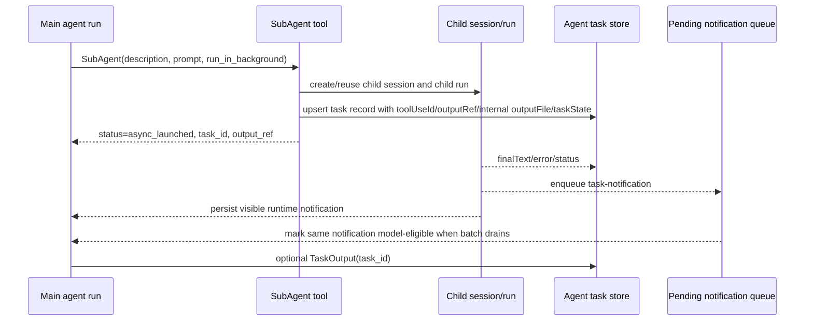

# Subagent Orchestration

本文档记录 OAH subagent 流程的目标形态、当前实现、以及对 Claude Code / opencode 的调研结论。后续 subagent 相关改造以 Claude Code 为主线，opencode 作为产品体验和 session 结构设计参考。

## 目标

Subagent 应该像一个可追踪、可恢复、可继续沟通的后台任务：

- 主 agent 通过 `SubAgent` 明确启动或继续一个子任务。
- 后台启动应立即返回 `async_launched`，让主 agent 不再轮询、睡眠或重复做同一件事。
- 子任务完成后，结果以结构化 `<task-notification>` 注入父会话。
- 主 agent 能通过 `TaskOutput` 用 `task_id` 显式读取任务状态和输出。
- 子任务输出在 OAH 使用 PostgreSQL 作为事实源；OAP 使用 SQLite 作为本地事实源。
- 子 session / child run / parent run / tool use id 必须能串起来，便于 UI、审计、恢复和后续继续任务。

## Claude Code 参考

关键参考文件：

- `references/claude-code-source-code/src/tools/AgentTool/AgentTool.tsx`
- `references/claude-code-source-code/src/tasks/LocalAgentTask/LocalAgentTask.tsx`
- `references/claude-code-source-code/src/tools/TaskOutputTool/TaskOutputTool.tsx`
- `references/claude-code-source-code/src/utils/task/diskOutput.ts`
- `references/claude-code-source-code/src/query.ts`
- `references/claude-code-source-code/src/Task.ts`

Claude Code 的核心模型：

- `AgentTool` 启动 local agent task。
- 异步启动结果包含 `status: "async_launched"`、`agentId`、`description`、`prompt`、`outputFile`、可选 `canReadOutputFile`。
- `LocalAgentTaskState` 是一等内部状态，保存 `type: "local_agent"`、`agentId`、`prompt`、`selectedAgent`、`agentType`、`model`、`error`、`result`、`progress`、`retrieved`、`messages`、`lastReportedToolCount`、`lastReportedTokenCount`、`isBackgrounded`、`pendingMessages`、`retain`、`diskLoaded`、`evictAfter`，并继承 task base 里的 `toolUseId` / `notified` 等字段。
- local agent 的 `outputFile` 通常是 agent transcript 的 symlink。
- 子任务完成后通过 `enqueueAgentNotification()` 进入 pending notification queue。
- notification XML 包含 `<task-id>`、可选 `<tool_use_id>`、`<output_file>`、`<status>`、`
`、可选 `<result>`、`<usage>`、`<worktree>`。
- `query.ts` drain pending notification，把它作为后续用户侧输入交给主 loop。
- Claude Code 的内部 Message 设计把模型兼容和 UI 呈现分开：task notification 虽然作为用户侧输入进入主 loop，但队列项带有 `mode: "task-notification"`，属于 non-editable notification，不按普通用户输入渲染。
- CLI UI 的 `UserAgentNotificationMessage` 只从 XML 中提取 `
` 和 `<status>`，渲染为一条带状态色点的 compact agent notification，而不是 “You” 消息气泡。
- Claude 的 agent finalization 会优先从最终 assistant/result content 提取干净 final text；`TaskOutputTool` 读取 local agent 时也优先使用 `agentTask.result`，避免把 transcript/tool result 当成最终答案。
- `TaskOutputTool` 可按 `task_id` 读取任务输出，支持 `block` 和 `timeout`，返回 `<retrieval_status>`、`<task_id>`、`<task_type>`、`<status>`、`<output>`。
- `TaskOutputTool` 在 Claude Code 中已经提示 deprecated，优先建议直接 `Read` task output file；但它仍是显式恢复/检查输出的稳定工具。

对 OAH 的结论：

- OAH 应优先模仿 Claude 的 tool call 边界、task state 字段、notification XML 和 `TaskOutput` 语义。
- OAH 不必照搬 disk transcript 作为事实源；在 OAH/OAP 双形态下，DB-first 更符合现有存储架构。
- OAH 刻意不把 `.output`/`output_file` 暴露给模型。Claude Code 这样做是因为 transcript symlink 是本地事实源；OAH 的事实源是 PG/SQLite，历史会话证明模型看到 `.output` 后会倾向直接 `Read` 文件并拿到 transcript/过程文本，效果明显变差。因此 OAH 只保留内部 `outputFile` metadata 和 `output_ref`，模型可见结果走 notification / `TaskOutput`。
- Claude 的 pending notification queue 已在 OAH 侧补齐为 session-scoped DB queue；后续重点转向 output file/Read 兼容、child session UX 和权限收窄。

## opencode 参考

关键参考文件：

- `references/opencode/packages/opencode/src/tool/task.ts`
- `references/opencode/packages/opencode/src/session/prompt.ts`
- `references/opencode/packages/opencode/src/session/index.ts`
- `references/opencode/packages/opencode/src/cli/cmd/tui/routes/session/index.tsx`
- `references/opencode/packages/opencode/src/cli/cmd/tui/routes/session/subagent-footer.tsx`

opencode 的核心模型：

- `task` 工具创建或复用一个 `parentID` 指向父 session 的子 session。
- `task_id` 直接是子 session id，可用于继续同一个 subagent session。
- 工具会等待子 session 完成，然后把 `<task_result>` 作为 tool output 返回父会话。
- tool metadata 保存 `sessionId` 和 `model`，TUI 能浏览和切换父子 session。
- 子 agent 的 `task` / `todowrite` 权限会按 agent permission 进行限制，避免无限递归和能力泄漏。

对 OAH 的结论：

- opencode 的同步返回模型不作为 OAH 主线，因为我们要对齐 Claude 的 async background agent。
- opencode 值得借鉴的是父子 session 关系的清晰暴露、子 session 可浏览、`task_id` 可继续、metadata 可追踪、以及 subagent 权限收窄。

## 当前 OAH 实现

当前已落地的行为：

- `SubAgent` 支持后台启动，并返回 `status: async_launched`。
- `SubAgent` 启动结果包含 `agentId`、`task_id`、`run_id`、`subagent_name`、`description`、`output_ref`；不再把 `outputFile` / `output_file` / `canReadOutputFile` 暴露给模型。
- tool call 的 `toolCallId` 会作为 `toolUseId` 贯穿到 delegated run metadata、`agent_tasks` 记录和 `<task-notification>`。
- 后台子任务完成后会立即在父 session 中生成 user-role `<task-notification>` runtime message。
- notification XML 包含 `<task-id>`、`<tool_use_id>`、`<output_ref>`、`<status>`、`
`、`<result>` 或 `<error>`；`<output_file>` 仅保留在历史兼容和内部 metadata 中，不进入新模型可见 XML。
- OAH 额外在 notification XML 中包含 `<child_run_id>`，用于 Web/Inspector 从 task 卡片精确跳转到子 run 时间线。
- notification / TaskOutput 会尽量携带 `<usage>`，字段包括 `total_tokens`、`input_tokens`、`output_tokens`、`tool_uses`、`duration_ms`。这些值由 child run 的 run steps 汇总而来。
- 子任务最终结果提取已按 Claude Code 思路收敛：
  - 优先使用 child run 中最近的有意义 assistant text。
  - 如果最后一条 assistant 只是纯 tool call，会向前回退到最近一条 assistant text。
  - 如果 assistant text 明显是过程话术，或 assistant 仍混合工具调用状态，则不把它当最终结果，而是创建一次 delegated output follow-up，让 subagent 只返回最终结果。
  - 只有在没有 assistant text 时，才兼容性回退到最后一个 tool result。
- 执行层现在会按当前 agent 的 OAH 内置工具白名单做最终授权；即使模型或 provider 返回了未暴露的 `SubAgent` / `TaskOutput` / native / action / skill tool call，也会在 tool execution 阶段返回 `tool_not_available_for_agent`，不会创建隐藏子任务。
- 外部 MCP/tool server 工具已接入统一运行期追踪：`tool.started` / `tool.completed` / `tool.failed` event、`tool_call` run step、tool result message metadata、tool call audit record 都会保存 `sourceType: "tool"`。
- 外部 MCP/tool server 工具在实际 `execute` 前会重新检查 `enabled`、`include`、`exclude` 和 `toolPrefix`；唯一短别名复用同一个 guarded tool definition，不能绕过 allowlist。
- 子任务完成时优先写入 session-scoped pending notification queue：
  - memory 使用 `InMemoryAgentTaskNotificationRepository`。
  - OAH / PostgreSQL 使用 `agent_task_notifications` 表。
  - OAP / SQLite 使用 workspace 本地 `agent_task_notifications` 表和 JSON payload。
- `ModelRunExecutor` 会在模型调用前 drain 已存在的 pending notifications；模型响应结束后如发现子任务刚完成，也会 drain 并继续同一个 run 的模型 loop。
- notification 有两段状态：
  - child terminal 时，先创建父 session runtime message，`visibleInTranscript: true`、`eligibleForModelContext: false`、`taskNotificationPendingModelDelivery: true`，因此 Web 端能立刻看到结果，但主模型不会提前看到 partial sibling result。
  - sibling batch ready 且 drain 时，更新同一条 message，标记 `taskNotificationConsumedAt`、`taskNotificationDeliveredToModel: true`、`taskNotificationPendingModelDelivery: false`、`eligibleForModelContext: true`，再进入 LLM 输入投影。
- drain 不再创建第二条 Web/Transcript message，而是更新同一个 runtime message；仅在没有 notification repository 的兼容路径下才直接创建可投喂 message。
- Runtime Message 已按 Claude Code 的内部 Message 设计拆分语义：
  - `role` 仍表示 provider chat role；task notification 保持 `role: "user"`，确保模型以 user-side input 接收。
  - `origin: "engine"` 表示它不是人类输入。
  - `mode: "task-notification"` 对齐 Claude Code 的 queued command mode，后续 UI、队列、投影、历史管理都应优先用它判断。
  - `EngineMessage.kind: "task_notification"` 是 OAH 内部 runtime 语义；旧数据如果只有 `metadata.taskNotification: true`，也会被投影为 `task_notification`。
  - Web / transcript 展示读取的是 runtime message 流，不读取 LLM 输入 projection；LLM projection 只是同一批 runtime messages 的消费侧过滤，主要通过 `eligibleForModelContext` 控制。
  - 外部 `createSessionMessage` 的用户 metadata 会清理 `runtimeKind`、`origin`、`mode`、`synthetic`、`taskNotification`、`delegatedUpdate` 等保留字段，避免客户端伪造 runtime notification。
- `agent_tasks` 是子任务输出事实源：
  - OAH / PostgreSQL 使用 `agent_tasks` 表。
  - OAP / SQLite 使用 workspace 本地 `agent_tasks` 表和 JSON payload。
  - tests / embedded 使用 memory repository。
- `agent_tasks.task_state` 保存 Claude-like `LocalAgentTaskStateRecord`：
  - `type: "local_agent"`、`agentId`、`prompt`、`agentType`、`model`。
  - `retrieved`、`lastReportedToolCount`、`lastReportedTokenCount`、`isBackgrounded`、`pendingMessages`、`retain`、`diskLoaded`、`notified`。
  - OAH 不把这个结构直接发给模型，它用于 runtime 恢复、UI、审计、后续继续任务和更接近 Claude Code 的 task lifecycle。
- `SubAgent(..., task_id=...)` 继续一个仍在运行的 child session 时，会按 Claude Code 的 `pendingMessages` 思路处理：
  - 新的 child run 先进入 child session 的 pending run queue，不并发执行同一个 subagent session。
  - `agent_tasks.task_state.pendingMessages` 记录追加 prompt，便于 UI/审计/恢复知道这不是一个新 worker，而是发给同一个 worker 的后续消息。
  - 当前 child run terminal 后，session queue dispatch 下一条 queued child run，pending messages 在 terminal task state 中清空。
- `TaskOutput` / `Read agent-task://.../output` 成功读取 terminal task 后会标记 `task_state.retrieved=true`；terminal notification 会标记 `task_state.notified=true`，usage 会同步到 `lastReportedToolCount` / `lastReportedTokenCount`。
- `TaskOutput` 已提供 Claude 风格的显式读取能力，支持 `task_id`、`block`、`timeout`。
- child session 浏览链路已落地：
  - `SessionRepository.listChildrenByParentSessionId()` 是存储侧统一接口。
  - `GET /api/v1/sessions/{sessionId}/children` 可列出直接子会话。
  - Web runtime sidebar 使用 `parentSessionId` 构建 session tree，subagent session 不再作为顶层 session 与父 session 并列展示。
  - Web conversation 识别 `<task-notification>` 和 `TaskOutput` XML，渲染为 subagent task 卡片，并可直接打开对应 child session。
  - Web conversation 对 task notification 使用 Claude Code 风格的 presentation 分流：后端仍保存 user-role synthetic message 以保持模型输入兼容，但 UI 会优先根据 `mode: "task-notification"`，并兼容 `metadata.taskNotification` / `<task-notification>`，把它渲染为 compact runtime notification，不显示为右侧 “You” 气泡。
  - service-routed PostgreSQL registry 已同步 `parent_session_id`，并在启动迁移时从 `sessions.parent_session_id` 回填历史 registry 行，保证 Web 工作区 session 列表能拿到父子关系。

仍保留的差异：

- Claude Code 的 pending queue 是进程内 task state 结构；OAH 为了支持 OAH/OAP 恢复与审计，将 pending queue 持久化到 PG / SQLite / memory repository。
- 如果父 run 已经 terminal，OAH 会把同一父 run 创建的 pending task notifications coalesce 到一个 `taskNotificationContinuation` run，再让主 agent 一次性看见 sibling subagents 的完成结果；Claude Code 主路径是 queued command drain，不创建单独 notification run。
- OAH 新模型可见消息不再包含 `output_file`；历史 `output_file` 仍可被 Web 解析，内部 metadata 仍可用于调试。Claude 的 transcript symlink 事实源不适合直接照搬到 OAH/OAP。
- OAH 还没有 `<worktree>` 输出。
- OAH 已提供 API 级 child session 浏览；UI/TUI 级父子 session 切换体验仍待完善。
- OAH 已有执行层内置工具授权 guard，并已为 MCP/tool server 工具补齐统一 run step / event / audit 记录和执行期 allowlist guard。

## 目标流程

## 分阶段路线

### Phase 1: Claude tool boundary

已完成：

- `SubAgent` 后台启动返回 `async_launched`。
- 透传 `toolUseId`。
- notification XML 增加 `<tool_use_id>`。
- `agent_tasks` 在 PG / SQLite / memory 中落地。
- 新增 `TaskOutput`。
- 模型可见 `SubAgent` / `<task-notification>` / `TaskOutput` 输出移除 `output_file`，避免模型被引导读取 transcript 文件。

### Phase 2: Pending Notification Queue

已完成：

- 新增 `AgentTaskNotificationRecord` 和 `AgentTaskNotificationRepository`。
- pending notification record 将 `toolUseId` 作为一等字段保存，便于和原始 `SubAgent` tool call 对齐。
- memory / PG / SQLite 分别实现 pending notification repository。
- 子任务完成时，如果父 run 仍 active，优先 enqueue notification payload，并立即创建父 session 中可见但暂不进入模型上下文的 runtime message。
- `ModelRunExecutor` 在模型输入前 drain 当前 session 的 pending notifications，并把它们作为 synthetic user messages 加入 `allMessages`。
- 模型响应结束后如果刚好有子任务完成，会 drain notification 并继续同一个 run 的模型 loop，让主 agent 看到子任务结果后继续思考。
- drain 后更新同一条 message 的 metadata，使其进入模型上下文，更新 consumed 状态，并发布现有 `message.completed` 兼容事件。
- 父 run terminal 后不再为每个 child completion 单独续跑；同一父 run 的 sibling child notifications 会等全部 terminal 后 coalesce 为一个 `taskNotificationContinuation` run。
- 保留 fallback notification run，仅在没有 notification repository 时启用。

### Phase 2.5: Claude-like Task Lifecycle

已部分完成：

- `agent_tasks.task_state` 从静态 metadata 扩展为 lifecycle state。
- 子任务启动时记录 `isBackgrounded`、`prompt`、`agentType`、`model`。
- 子任务 terminal 后记录 `notified`、`evictAfter`、token/tool count，并清空 `pendingMessages`。
- `TaskOutput` 成功读取 terminal task 后记录 `retrieved=true`。
- 运行中的 subagent 收到 `SubAgent(task_id=...)` 追加消息时，child run 进入 child session queue，`pendingMessages` 记录待处理 prompt。

后续可选：

- Web 端用 `pendingMessages` 显示“已给 subagent 排队的后续指令”。
- `retain` / `diskLoaded` 目前主要是为 child session UI 和 transcript bootstrap 预留，后续可在打开 subagent panel 时赋予真实行为。

### Phase 3: Output File / Read Compatibility

已完成但有 OAH 特化取舍：

- 保持 DB-first，不把 `.output`/`output_file` 作为模型可见事实源。
- `Read` 支持 `agent-task://<taskId>/output`，并从 `agent_tasks` 读取当前状态/输出。
- `Read` 支持历史 `output_file` 兼容路径，但新 `SubAgent` / `<task-notification>` 不再返回该路径。
- 读取结果复用 `TaskOutput` 的 XML 结构，包含 `<retrieval_status>`、`<task_id>`、`<task_type>`、`<status>`、`<output_ref>`、`<output>` / `<error>`。
- `TaskOutput` 的 tool prompt 明确建议等待 notification；只有显式检查/恢复 missed output 时才用 `TaskOutput` 或 `agent-task://<taskId>/output`。

后续可选：

- OAH/OAP 可以物化 `.openharness/state/tasks/<taskId>.output` 作为调试缓存，但不要把路径放进模型默认输出；事实源仍是 PG/SQLite。

### Phase 4: Session UX

已部分完成：

- API 暴露 parent session 的直接 child sessions：`GET /api/v1/sessions/{sessionId}/children`。
- `SessionRepository` 增加 `listChildrenByParentSessionId()`，memory / PostgreSQL / SQLite / service-routed storage 均已接入。
- CLI API client 增加 `listChildSessions(parentSessionId)`，便于 TUI 后续接入。
- Web runtime sidebar 已按 `parentSessionId` 渲染 session tree：
  - 顶层列表只显示没有 `parentSessionId` 的主 session。
  - 子 session 作为父 session 的下一层显示，并带有 subagent 图标和 tooltip 标识。
  - 当前选中的子 session 会自动展开它的祖先 session。
  - 删除父 session 时会沿本地 session tree 一起移除已知子 session。
- Web conversation 已识别 subagent task 输出：
  - `<task-notification>` 不再只作为普通 XML 文本显示，而是展示状态、summary、result/error、`child_run_id`、`output_ref`、`usage` 和 task lifecycle 徽标；历史 `output_file` 只做兼容解析，不再作为新 UI 主信息展示。
  - `TaskOutput` / `Read agent-task://.../output` 返回的 `<retrieval_status>` XML 也会展示为同一类 task 卡片，并携带 `child_session_id` / `child_run_id` / `usage` / `task_state`。
  - 卡片中的 `task_id` 在 OAH 中等于 child session id，因此可以直接打开 child session。
  - 如果 task 卡片带有 `child_run_id`，可以直接打开 Inspector 的 run 时间线。
- service-routed PostgreSQL 的 `session_registry` 已持久化和回填 `parent_session_id`，避免通过 workspace session list 同步到 Web 时丢失父子关系。

后续目标：

- Web/TUI 能像 opencode 一样查看 subagent session。
- `task_id` 继续同一个 child session 的行为在 UI 上可见。
- UI 可显示 queued pending message 数量和 retrieved/notified/background/token/tool 状态，但不展示 pending prompt 原文。
- notification 和 TaskOutput 都已能跳转到 child session 和 child run。

### Phase 5: Permissions and Safety

已部分完成：

- 将“模型侧可见工具”和“执行侧可运行工具”拆成两条边界：
  - `activeToolNamesForAgent()` 保留模型请求/AI SDK active tools 的语义。
  - `visibleEngineToolNamesForAgent()` 只计算 OAH 内置工具白名单，用于执行期最终授权。
  - `isToolVisibleToAgent()` 只基于 `visibleEngineToolNamesForAgent()`，不再因为 agent 有 enabled external tool server 就放行所有内置工具。
- `ToolExecutionService` 在 before-tool hooks 和 run step 创建之前检查工具可用性；未授权工具直接抛出 `tool_not_available_for_agent`。
- subagent mode 默认不能继续调用 `SubAgent` / `TaskOutput`，即使配置里误填了 `subagents`，也会被 `canDelegateFromAgent()` 和执行层 guard 拦住。
- 已增加 focused tests：
  - subagent 试图调用 nested `SubAgent` 时，只生成 failed tool result，不创建孙级 child session。
  - agent 有 enabled external tool server 时，仍不能执行未授权的 OAH 内置 `SubAgent`。
  - 外部工具成功时生成 `tool.started` / `tool.completed`、completed `tool_call` step、tool result metadata 和 audit record。
  - 外部工具失败时生成 `tool.failed`、failed `tool_call` step、failed tool result message 和 audit record。
  - MCP 工具 `include` / `exclude` 在 prepare 后被篡改时，prefixed 名称和唯一短别名都会在执行期被拦截。

后续目标：

- 借鉴 opencode，对 subagent 可用 native/action/skill/MCP 能力继续收窄和显式化。
- 增加 max concurrent subagents、max depth、task timeout、output size cap。

### Phase 6: Parallelism and Worker Affinity

已部分完成：

- 现场会话 `ses_380876322f5a4233b5fe7145b4e1a4b9` 证明：一次父 run 可以正确创建多个 background subagents，`delegatedRuns` 中会记录全部 child run。
- 该会话的问题不在 `SubAgent` tool call 创建阶段，而在 Redis worker 调度阶段：
  - child run 都带 workspace placement / preferred-worker affinity。
  - 当 owner runtime 只有少量本地 slot 时，父 run 与先启动的 child run 会占满本地 slot。
  - 其他 runtime 即使有 idle worker，也不能 claim 该 workspace 的 preferred run。
  - 旧 worker-pool sizing 会用 remote idle worker 抵扣本地扩容需求，导致 preferred subagent backlog 没有及时扩出 owner-local slot。
- Redis scheduling pressure 增加 affinity 维度：
  - `preferredReadySessionCount`
  - `preferredReadyQueueDepth`
  - `preferredSubagentReadySessionCount`
  - `preferredSubagentReadyQueueDepth`
- worker pool sizing 对 preferred backlog 使用 local busy / local active 计算，不再让 remote idle worker 满足 owner-local backlog。
- health contract / worker pool snapshot / recent decisions / Web Storage 面板均展示 preferred pressure，便于诊断“看起来有 idle worker，但某 workspace 的 subagent 仍排队”的情况。
- 已增加 focused regression test：remote idle workers 不应抵消 local owner 的 preferred subagent backlog。
- 现场会话 `ses_380876322f5a4233b5fe7145b4e1a4b9` 的 `TaskOutput` / `Read output_file` 失败根因：
  - Docker OAH 使用 service-routed PostgreSQL persistence。
  - `createPostgresRuntimePersistence()` 已提供 `agentTaskRepository` / `agentTaskNotificationRepository`，但 `createServiceRoutedPostgresRuntimePersistence()` 曾经没有对外暴露和路由这两个 repository。
  - Engine 因此认为 task output storage 未配置，`TaskOutput` 和 DB-backed `Read output_file` 都返回 `agent_task_output_unavailable`。
  - 失败不是因为 `task_id` 错误；该会话里的 `task_id` 就是 child session id，符合 Claude/opencode 风格。
- service-routed PostgreSQL 现在会把 `agent_tasks` 按 workspace service 路由到 service DB，把 pending task notifications 按 parent session 路由到对应 DB。
- 为历史缺失 `agent_tasks` 的会话增加了 recovery：`TaskOutput` 找不到 task row 时，会从 child session、child run、parent run `delegatedRuns` metadata 和 child messages 恢复 task 记录，并在 child run 已 terminal 时回填 final output。
- 现场会话 `ses_2042339fcc864d7a964a7207f62d20cb` 暴露了两个细节：
  - sibling subagents 的 notification 可以等全部 terminal 后再 coalesce 给父 agent，但注入父会话的 runtime message `createdAt` 必须保留各自 child completion time；drain/consume 时间只放入 metadata，避免 Web conversation 看起来所有 subagent 都在最后一刻返回。
  - subagent final output 不能用最后一个成功 tool result 兜底。成功的 `WebFetch` / `Bash` result 只是过程证据，不是 delegated final answer；如果没有可用 assistant final text，应发 delegated output follow-up 让 subagent 综合已有工作输出最终结果。失败 tool result 仍可作为错误诊断兜底，例如 nested `SubAgent` 被执行期 guard 拦截。

后续目标：

- 对照 Claude Code 的 Task 行为，继续优化“多个 background subagents 同组完成后的主 agent 唤醒策略”：
  - 当前机制仍可能在第一个 child terminal 后先产生一次父会话续跑。
  - 更接近 Claude 的体验是 notification 先沉淀为 runtime message / queued command，主 agent 在合适时机批量读取，而不是每个 child 完成立刻打断式续跑。
- 为 subagent run 增加更清晰的 timeout / stuck diagnostics，尤其是长时间 `waiting_tool` 的 WebFetch / model step。
- 对 worker pool 做 workspace-affinity-aware 的调度指标，不只统计 preferred backlog 总量，还能按 owner runtime / workspace 聚合。

## 实现原则

- Claude Code 是主行为目标；opencode 只作为产品结构和 session UX 参考。
- 优先稳定 tool call 边界，再改调度和 UI。
- 任何 notification 迁移都必须防止重复消费。
- OAH / OAP 的事实源分别是 PG / SQLite，不把 transcript 文件作为唯一事实源。
- XML 字段尽量与 Claude 保持一致；OAH-only 字段要有明确兼容理由。
